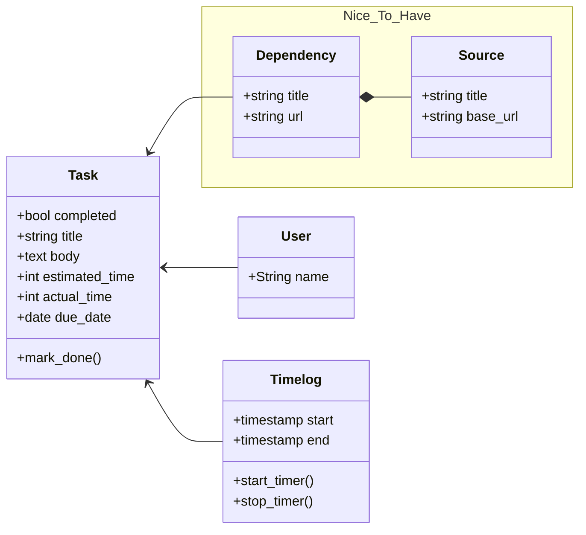

# README

Rails app created using:

```bash
rails new tasks --skip-action-mailbox --skip-hotwire --skip-action-text --database=postgresql --css bootstrap
```

## Requirements

- [ ] Make the Vue app loads on tasks index only
- [ ] Convert tasks from html to Vue components
- [ ] Check off tasks
- [ ] Start/stop timers for a task

## Database structure

This is a basic initial structure of the models


