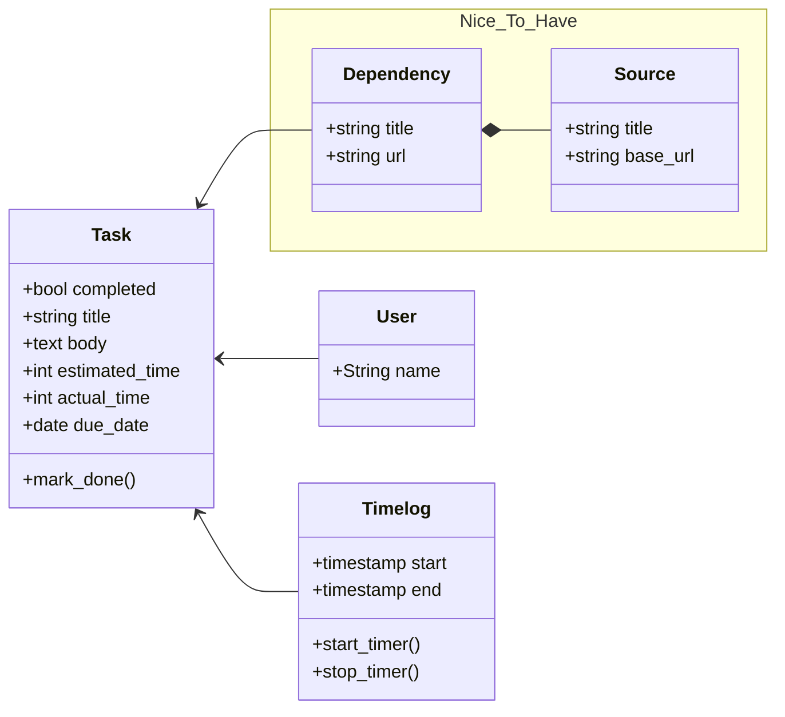

# README

Rails app created using:

```bash
rails new tasks --skip-action-mailbox --skip-hotwire --skip-action-text --database=postgresql --css bootstrap
```

## Requirements

- [x] Make the Vue app loads on tasks index only
- [x] Convert tasks from html to Vue components
- [x] Load tasks from API
- [x] Check off tasks
- [x] Start/stop timers for a task
- [x] Get how much minutes each task has on record
- [x] Add Vue router
- [ ] Update all routes resources to be within `api` namespace and only accessible as API
- [ ] Show a report for a task how long did it take over the days
    - https://vue-chartjs.org/examples/
- [ ] Convert Create new task form to Vue

## Database structure

This is a basic initial structure of the models


